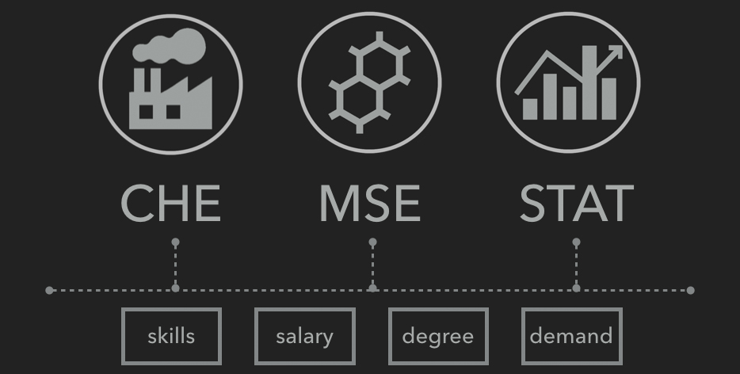

Team Member 
Jiewei Chen 
Da Xue 

 <h1>Recent Job Market Analysis</h1>
 <h4> STA 141B, Winter 2017 </h4>

What is the current demand in the job market? How much money can I make if I major in statistics? What are the most important skills to put into my resume? Where are the hiring companies located? How does the job market differ across different majors? When is the job market largest?…

These practical questions are faced by new graduates and even younger college students. This project tries its best to help the freshmen to choose the best major; senior and graduate students to draw a big picture of the current job market.

The majority of this project analyzes and compares the job market for the 3 majors of STAT, CHE, and MSE. (Because we are CHE and MSE students considering of pursuing a second degree!)

 To find out the answers, check out our <a href = 'https://youtu.be/vwKmp3zmiXg')>video demonstration</a> and <a href = 'https://celinechen0211.github.io/JobMarket/jobmarket.html'>website</a> to know more!!!

